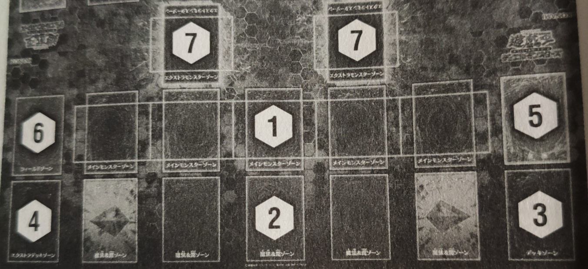

=================
决斗的基本概念
=================

.. role:: strike
    :class: strike

决斗必要之物
==============

- 卡组（40～60张）：同名卡最多放置3张。
- EX卡组（0～15张）：有别于卡组，放置满足特定条件才能呼出的怪兽。
- 副卡组：在两场决斗之间用来调整卡组的预备用卡。
- 纸笔：记录基本分，基本分变动时，需要互相确认。
- 计算器
- 骰子·硬币
- 怪兽衍生物

.. attention:: 实际上副卡组•主卡组•额外卡组中同名卡合计最多只能放入3张。

决斗的胜利条件
================

基本上，通过给与战斗·效果伤害，让对方基本分变成0时决斗胜利。各种取得胜利的方法：

- 让对方基本分变成0的场合
- 对方必须抽卡但无法抽卡的场合
- 让决斗胜利的卡满足条件的场合

决斗的流程
=============

1. 决斗开始时，双方各抽5张卡，基本分8000。
2. 从手卡召唤怪兽，使用魔法·陷阱卡让局面变得对自己有利。
3. 用召唤的怪兽攻击，给与对方战斗伤害。
4. 重复上述行动，让对方基本分变成0的玩家取得决斗胜利。

决斗场地
============

    决斗场地

1. 主怪兽区域
----------------

放置召唤·特殊召唤的怪兽的区域。5个区域每个放置1只怪兽。在主怪兽区域最多放置5个怪兽。

2. 魔法·陷阱卡区域
---------------------

使用魔法·陷阱卡时放置的区域，最多放置5张。P怪兽可以在左右两端区域当作魔法卡发动，这个场合当作P区域。

3. 卡组区域
--------------

卡组里侧表示放置在这个区域，玩家从这里把卡加入手卡。除非使用了一些卡的效果，基本上不能确认卡组中的卡。

4. EX卡组区域
----------------

| 融合·S·X·连接怪兽里侧表示放置的场所。另外，决斗途中也可能把P怪兽表侧加入，以及特殊召唤。
| 决斗中从场上送去墓地的P怪兽不送去墓地，而是在额外卡组表侧表示放置。

5. 墓地
-----------

被战斗破坏的怪兽或使用完的魔法·陷阱卡表侧表示放置的场所。双方玩家可以互相确认，墓地放置的卡的顺序不能变更。

6. 场地区域
---------------

放置自己发动的场地魔法卡的场所。场地魔法卡不放置在魔法·陷阱卡区域，也就不计入魔法·陷阱卡区域的5张之内。

7. EX怪兽区域
----------------

从EX卡组用特殊方法出场的怪兽放置的区域。左右各1个区域，决斗中基本上1个玩家只能使用其中1个区域。这个区域不计入主怪兽区域的5张之内。

其他：除外的卡放置在场地外
-------------------------------

因卡的效果而被除外的卡，不会混在决斗场地内，放置在场地外。

.. note:: 没有专门放置被除外的卡的区域，没有\ :strike:`除外区`\ 。

OCG卡的种类
==============

